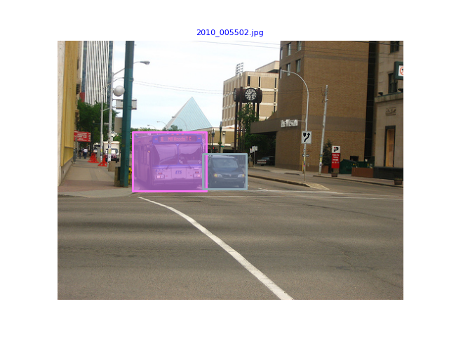

# HKU-DASC7606-A1
HKU DASC 7606 Assignment 1 (Computer Vision: Object Detection), 2023-24 Spring

**For questions and discussion**,
- We encourage you to use [GitHub Issues](https://github.com/ilnehc96/HKU-DASC7606-A1/issues) of this repository.
- Or if you prefer online doc: [Discussion doc](https://connecthkuhk-my.sharepoint.com/:w:/g/personal/ilnehc_connect_hku_hk/EbjCi5B1nZ1PhoLOsyCXvXoB1rvQcwQSMyb-uL3v7ORNPQ?e=fkUIeC).

This codebase is only for HKU DASC 7606 (2023-2024 Spring) course. Please don't upload your answers or this codebase to any public platforms (e.g., GitHub) before permitted. All rights reserved.


## 1 Introduction

### 1.1 Background: Object Detection
Object detection is one of the most essential tasks in computer vision.  This task aims to recognize and localize objects on 2D images. In this task, we provide five categories of objects, including cat, dog, bus, car, and bird. This assignment focuses on solving the detection problem from a single image.

<div align="center">
  
</div>
<p align="center">
  Figure 1. An example of 2D Object Detection from the given dataset.
</p>

### 1.2 What will you learn from this assignment?
This assignment will walk you through a classic 2D object detection task. You will implement a famous 2D object detection method, [RetinaNet](https://arxiv.org/abs/1708.02002), and the famous focal loss proposed with the network, from scratch.

The goals of this assignment are as follows:

- Understand the basic theories of deep learning exspecially for object detection task, such as the networks of ResNet, the detection loss function, etc.
- Gain experience of implementing neural networks with a popular deep learning framework PyTorch.
- Develop a deep learning system from scratch, including network design, model training, hyperparameter tuning, training visualization, model inference and performance evaluation.

## 2 Setup

You can work on the assignment in one of two ways: locally on your own machine, or on a virtual machine on HKU GPU Farm.

### 2.1 Working remotely on HKU GPU Farm (Recommended)

Note: after following these instructions, make sure you go to work on the assignment below (i.e., you can skip the Working locally section).

As part of this course, you can use HKU GPU Farm for your assignments. We recommend you follow the quickstart provided by the [official website](https://www.cs.hku.hk/gpu-farm/quickstart) to get familiar with HKU GPU Farm.

After checking the quickstart document, make sure you have gained the following skills:

+ Knowing how to access the GPU Farm and use GPUs in interactive mode. We recommend using GPU support for this assignment, since your training will go much, much faster.
+ Getting familiar with running Jupyter Lab without starting a web browser.
+ Knowing how to use tmux for unstable network connections.

### 2.2 Working locally

If you have the GPU resources on your own PC/laptop and wish to use that, that’s fine – you’ll need to install the drivers for your GPU, install CUDA, install cuDNN, and then install PyTorch. You could theoretically do the entire assignment with no GPUs, though this will make training the model much slower.

### 2.3 Environment Setup

**Installing Python 3.8+**: To use python3, make sure to install version 3.8+ on your local machine.

**Virtual environment**: If you decide to work locally, we recommend using a virtual environment via anaconda for the project. If you choose not to use a virtual environment, it is up to you to make sure that all dependencies for the code are installed globally on your machine. To set up a conda virtual environment, run the following:

```bash
conda create -n retinanet python=3.8
conda activate retinanet
```

Install the PyTorch environment following the official instructions. Here we use PyTorch 1.10.1 and CUDA 11.3. This environment is valided on HKU GPU Farm Phase 2. You may also switch to another version by specifying the version number.

```bash
pip install torch==1.10.1+cu113 torchvision==0.11.2+cu113  -f https://download.pytorch.org/whl/torch_stable.html
```

Install other requirements:

```bash
pip install pycocotools
pip install tqdm
pip install scikit-image
```

> You can seek some help about HKU GPU Farm and basic environment setup from TA Fred (u3580293@connect.hku.hk).

## 3 Working on the assignment

### 3.1 Basic knowledge
Basic knowledge about object detection is necessary for completing the task. Please refer to the related papers (e.g., [Fast R-CNN](https://arxiv.org/abs/1504.08083), [YOLO](https://arxiv.org/abs/1506.02640)). You should also carefully read the paper of [RetinaNet](https://arxiv.org/abs/1708.02002).

### 3.2 Task description

In this assignment, you are going to realize object detection with the provided images. 

- You must fill in the blanks and submit the completed codes for this assignment with the provided codebase. This assignment offers an incomplete codebase for object detection with modified RetinaNet.
- You must submit the test data's model outputs with your completed codes. The test set will be released 1 week before the deadline. You should utilize hyperparameter tuning and other widely-used techniques to improve detection performance.
- You must submit a maximum of 4-page technique report to explain how you improve the object detection performance. Besides, some visualization results (e.g., loss curve) are encouraged in this report.

### 3.3 Get Data and Code

The dataset is available [HERE](https://drive.google.com/file/d/1aJHCU-iAWJwqOizzYVhuHr6l_wPJWE_p/view?usp=sharing). The dataset is now composed of train and val parts and their corresponding annotations. Note that test images with fake annotations is released one week before the assignment deadline: [HERE](https://drive.google.com/file/d/19xLx67bd3a0aW93NYILdw5iqgANXDpSH/view?usp=sharing) (Please extract the zip file and put the files fowlling the structure below). The dataset structure follows [COCO format](https://cocodataset.org/#format-data).

Download codes:

```bash
git clone https://github.com/ilnehc96/HKU-DASC7606-A1.git
cd HKU-DASC7606-A1
```

After downloading and extracting the dataset, you should put all files following the structure below:

```
└── HKU-DASC7606-A1
    ├── data
           ├── image                   # images
               ├── train
               ├── val
               └── test                # (released before DDL) test images
           ├── train.json              # train set annotation
           ├── val.json                # validation set annotation
           └── test.json               # (released before DDL) **test image ids with fake annotations**
    ├── retinanet                      # src code of retinanet
    ├── train.py                       # main script to train the model
    ├── test.py                        # main script to test the model
    ├── test_submission.py             # (released before DDL) final script for evaluation on test set by TA, check the format of submission file
    ├── vis.py                         # visualization script
    └── README.md
```

### 3.4 Scripts

#### Train

```bash
python train.py --coco_path ./data --output_path ./output --depth 50 --epochs 20
```

#### Evaluation

Use this script to generate test set predictions for submission

```bash
python test.py --coco_path ./data --checkpoint_path ./output/model_final.pt --depth 50
```

or evaluate your model on validataion results
```bash
python test.py --coco_path ./data --checkpoint_path ./output/model_final.pt --depth 50 --set_name 'val'
```

#### Visualization

```bash
python vis.py
```

Please see more arguments input in corresponding scripts.

### 3.5 Assignment tasks

**Task 1: Filling in the Model**

You should fill in two blanks in file [retinanet/model.py](retinanet/model.py).

**Task 2: Filling in the FPN Network**

You should fill in one blank in file [retinanet/FPN.py](retinanet/FPN.py).

**Task 3: Filling in the Object Detection Loss Function**

You should fill in two blanks to complete object detection loss, Focal Loss which is a core component of RetinaNet, in file [retinanet/losses.py](retinanet/losses.py).

**Task 4: Fill in the dataloader**

Please fill in two blanks to complete the dataloader in file [retinanet/dataloader.py](retinanet/dataloader.py).

**Task 5: Implement the training pipeline**

Please fill in three blank to complete the basic training pipline in file [train.py](train.py).

**Task 6: Predict the outputs of the test set**

This task requires you to predict the outputs of the test set. We will release the test set for you to generate prediction results for submission **7 days before the deadline**.

After downloading the test set ([released HERE](https://drive.google.com/file/d/19xLx67bd3a0aW93NYILdw5iqgANXDpSH/view?usp=sharing)), you should organize the files as the structure above and then run the evaluation command line to generate final json file. After generating final json file, you can use the script below to test the format of your results (Will be released with the test set). **We will not debug on format issues when do the final evaluation, which means you will lose full marks for the performance part if the format is not correct.**

```bash
python test_submission.py --coco_path ./data
```

**Task 7: Improve the detection performance**

You are required to improve the baseline model with your own configuration. There are lots of ways to improve the baseline model. Here are some suggestions for you.

+ Hyper-parameter tuning. There are lots of important hyper-parameters, such as the optimizer, learning rate, batch size, warm-up and training iterations, etc.

+ Different neural network architectures for predicting the span. You may choose a more advanced neural network architecture and design your own customized neural network. If you have any tries on this part, you should submit all your codes, model output, and the report to explain your understanding about how to improve the detection performance with more advanced architecture. You should explain why these improvements can enhance the performance in your own words instead of just cloning some codes and performing inference. See details in Sec. 3.5.

+ Loss functions designs. You may add label smoothing or other tricks or come up with a new loss function or training objectives.

**Task 8: Write a report (no more than 4 pages)**

Your report should include three main sections: introduction, method, and experiment. See details below.


### 3.6 Files to submit

1.  Prepare a final report in PDF format (**no more than 4 pages**)

    1.1 Introduction. Briefly introduce the task & background & related works.

    1.2 Methods. Describe the basic method you implement for RetinaNet, including ResNet, Focal Loss, etc. Describe what you did to improve the baseline model performance. For example, this may include but is not limited to: (i) Hyper-parameter tuning, e.g. learning rate, batch size, and training epochs. (ii) Different neural network architectures. (iii) Loss functions. 
    
    1.3 Experiments & Analysis **(IMPORTANT)** Analysis is the most important part of the report. Possible analysis may include but is not limited to:

      - Dataset analysis (dataset statistics)
      - Ablation studies on validation set. Analyze why better performance can be achieved when you made some modifications, e.g. hyper-parameters, model architectures, and loss functions. The performance on the validation set should be given to validate your claim.
      - Qualitative evaluations of your model. Select several specific cases in the dataset and see if your model correctly finds the answer. Failure case analysis is also suggested.
      - More analysis, such as the loss curve. We would not provide the code to save logs with tools such as [tensorboard](https://pytorch.org/tutorials/recipes/recipes/tensorboard_with_pytorch.html) or [wandb](https://docs.wandb.ai/guides/integrations/pytorch) for drawing the figure. It is easy to implement and you should find recourses online to enrich your report.
  
      > Due to the relative ease of the tasks in original code, we highly recommend you realize the qualitative and other analysis to enrich your report and get high report scores.

2. All the completed codes. This should be a folder (eg HKU-DASC7606-A1) containing all the original codes.

3. Models, in the format of model checkpoint link (model_link.txt) due to the limitation on submission file size.

4. **Important!** Generated results on the test set. Please make sure you can successfully run the `test_submission` code before submission.

5. If you use other advanced models, submit
  
    5.1 All the codes, model links, and prediction reuslts, separately with our required files above.
   
    5.2 (optional) README.md that describes the final model and results for marking your assignment. We will use predictions from this original code for evaluation by default if not clearly specified. 

If your student id is 12345, then the compressed file for submission on Moodle should be organized as follows:

```
12345.zip (or 12345.tar / 12345.tar.gz)
├── report.pdf
├── your source code
├── model_link.txt
├── test_bbox_results.json
|
├── (optional) README.md
├── (optioinal) source code for bonus
├── (optioinal) bonus_model_link.txt
└── (optioinal bonus) bonus_test_bbox_results.json
```


### 3.7 Timeline

Jan 30, 2024 (Tue): The assignment release.  
Feb 25, 2024 (Sun): The test set release.  
Mar 3, 2024 (Sun): Submission deadline (23:59 GMT+8).

Late submission policy:

- 10% for late assignments submitted within 1 day late. 
- 20% for late assignments submitted within 2 days late.
- 50% for late assignments submitted within 7 days late.
- 100% for late assignments submitted after 7 days late.

### 3.8 Need More Support?

For any questions about the assignment which potentially are common to all students, your shall first look for related resources as follows,
- We encourage you to use [GitHub Issues](https://github.com/ilnehc96/HKU-DASC7606-A2/issues) of this repository.
- Or if you prefer online doc: [Discussion doc](https://connecthkuhk-my.sharepoint.com/:w:/g/personal/ilnehc_connect_hku_hk/EbjCi5B1nZ1PhoLOsyCXvXoB1rvQcwQSMyb-uL3v7ORNPQ?e=fkUIeC).

For any other private questions, please contact Li Chen (ilnehc@connect.hku.hk) and Haibao Yu (yuhaibao@connect.hku.hk) via email.

## 4 Marking Scheme:

Marks will be given based on the performance that you achieve on the test and the submitted report file. TAs will perform an evaluation of the predicted answers.

The marking scheme has three parts, (1) the completeness of the code (30% marks), (2) the performance ranking based on mAP (40% marks), and (3) the final report (30% marks):

1. For the coding part (30%), you need to complete all the required codes in order to get the full score. Partial score will be considered rarely and carefully.

2. For the performance part (40%), the mark will be given based on the performance (`mAP, Average Precision, IoU=0.5:0.95, area=all`) of your result on test set. The default training setting (ResNet-50, epoch20, default batch size, optimizer, learning rate, etc), after you finish the required blanks, will get 34.2% mAP on the validation set and 37.7% mAP on the test set.

    (1) mAP larger than 40% will get the full mark of this part.  
    (2) mAP between 38%-40% will get 90% mark of this part.  
    (3) mAP between 36%-38% will get 80% mark of this part.  
    (4) mAP between 32%-36% will get 70% mark of this part.  
    (5) mAP between 24%-32% will get 60% mark of this part.  
    (6) mAP between 10%-24% will get 50% mark of this part.  
    (7) Others will get 0% mark.

After evaluation, you will see a table like below. The number in first line is the result we will use for marking.

```
Average Precision  (AP) @[ IoU=0.50:0.95 | area=   all | maxDets=100 ] = 0.377
Average Precision  (AP) @[ IoU=0.50      | area=   all | maxDets=100 ] = xxx
Average Precision  (AP) @[ IoU=0.75      | area=   all | maxDets=100 ] = xxx
Average Precision  (AP) @[ IoU=0.50:0.95 | area= small | maxDets=100 ] = xxx
Average Precision  (AP) @[ IoU=0.50:0.95 | area=medium | maxDets=100 ] = xxx
Average Precision  (AP) @[ IoU=0.50:0.95 | area= large | maxDets=100 ] = xxx
Average Recall     (AR) @[ IoU=0.50:0.95 | area=   all | maxDets=  1 ] = xxx
Average Recall     (AR) @[ IoU=0.50:0.95 | area=   all | maxDets= 10 ] = xxx
Average Recall     (AR) @[ IoU=0.50:0.95 | area=   all | maxDets=100 ] = xxx
Average Recall     (AR) @[ IoU=0.50:0.95 | area= small | maxDets=100 ] = xxx
Average Recall     (AR) @[ IoU=0.50:0.95 | area=medium | maxDets=100 ] = xxx
Average Recall     (AR) @[ IoU=0.50:0.95 | area= large | maxDets=100 ] = xxx
```

4. For the final report part (30%): The marks will be given mainly based on the richness of the experiments & analysis.

    (1) Rich experiments + detailed analysis: 90%-100% mark of this part.  
    (2) Reasonable number of experiments + analysis: 70%-80% mark of this part.  
    (3) Basic analysis: 50%-60% mark of this part.  
    (4) Not sufficient analysis: lower than 50%.

## Reference

1. Focal Loss for Dense Object Detection. ICCV 2017 (Best Student Paper Award): [https://arxiv.org/abs/1708.02002](https://arxiv.org/abs/1708.02002)
2. Deep Residual Learning for Image Recognition. CVPR 2016 (Best Paper Award): [https://arxiv.org/abs/1512.03385](https://arxiv.org/abs/1512.03385)
3. Microsoft COCO: Common Objects in Context. ECCV 2014: [https://arxiv.org/abs/1405.0312](https://arxiv.org/abs/1405.0312)
